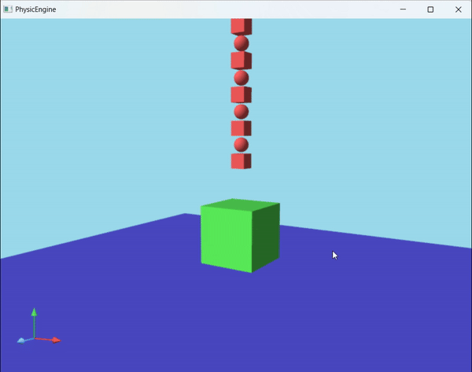

## 物理引擎

爸爸：KD-Engine  爷爷：Bullet Physics

- 碰撞检测：SAT

- 约束求解：Sequential Impulse

- 毁伤算法：Voronoi剖分

- 坦克：待移植

### 效果

- gif帧率20帧，实际运行帧率为60帧
- 破碎效果：根据事先设定好的毁伤源位置预计算（最终目标是根据坦克炮弹的击中位置实时计算）

### 开发日志

- 2.26-3.3
  
  - box box碰撞跑通，引擎框架搭建完成
  
  - 破碎算法移植完成
  
  - 单线程，可以满足基本运行帧率

- 3.4-3.10
  
  - mesh mesh碰撞完成，待解决问题：
    
    - 穿模：一定程度上解决
    - penetration约束求解是否必要：应该是KD引擎里用了两份不同版本的算法，penetration部分在现有算法里没有影响，不必纠结
  
  - 多线程加速，待解决内容：
    
    - 时序一致性：已解决
    - 加锁问题：已解决

- 3.11-3.17
  
  - sequential impulse稳定性
    
    - 抖动、小程度穿模（一定程度上解决）cid：79a2a09a
  
  - 其他碰撞对：
    
    - box mesh = mesh mesh √
    - sphere shpere √
    - box shpere √
    - mesh shpere = sphere triangles √
    - cylinder cylinder = mesh mesh √
    - box cylinder = mesh mesh √
    - shpere cylinder √
    - mesh cylinder = mesh mesh √

- 3.18-3.24
  
  - 内存优化
    
    - FrictionContactConstraint对象占用空间较多，每一帧反复创建销毁，适合使用内存池，其他部分待定
  
  - Clion使用vs编译
    
    - 语法检查更严格

  - 检查碰撞检测
    - 1、margin
      - box-sphere取消getSphereDistance的margin
      - sphere-convex取消radiusWithThreshold的margin
    - 2、碰撞对顺序
      - 涉及cylinder的全部将cylinder放在前面
      - 最近点需要统一为物体B上的点
  
  - 履带坦克
    
    - 射线检测异常：
      - 地面fixedBody须设置质量和惯性矩阵均为0
      - 轮子添加实体之后，须设置raycastExcludeIds列表
      - 履带片不宜添加实体，否则会对非kinematic地面产生错误impulse
    - 优化点：
      - 1、使用多个射线检测（目前aabb检测不支持这种方式）
      - 2、使用碰撞检测代替射线检测（已选）
        - v0.1(10012d6): 车轮会抖动(1)，行进时suspension会异常变短(2)，过坎时计算出错(3)
        - v0.2(e25dbca): (3)已解决，(2)进一步发现有两种情况，一是以地面法矢量为接触法线，二是以车轮法矢量为接触法线，前者车轮下陷，后者suspension缩短
        - v0.3(ebceaaa): (1)部分解决，仍有轻微抖动，解决方式为当没有接触发生时，按递增方式还原suspension；(2)待解决

### 问题日志

- 窄域碰撞优化：contact point cache size需要设置较大一点，实际计算时取depth最大的若干个即可，由于contact points已排过序，此时这些contact point即为最深的点

- 复杂几何体碰撞：偶尔穿模，示例为blob/0311/test4.obj
  
  - 棱碰撞问题：较薄的刚体在尖棱与其他模型发生碰撞时容易穿模，
    - 原因：clipFaceAgainstFace计算时所选取的witnessFace未能包含实际侵入点
    - 解决：findSeparateAxis找到最深点时检查是否在对面刚体内，若在则直接加入contact points
  - 严重问题：find separate axis的contact point计算错误 
    - 原因：分离轴支撑点计算错误（应为物体上的点，不是在轴上的投影点）

- 多线程Release版崩溃：lambda参数捕获机制
  
  - 多线程lambda this = &捕获成员变量出现错误，只能函数内拷贝成局部变量，然后用&传递，=和名称传递都不行，可能是因为多线程重复访问同一个地址，编译器的优化保护机制有影响
  - 3.18发现：this捕获改成auto c = this, &c则可以正常运行，原因暂不清楚

- sequential impulse稳定性
  
  - 尝试使用各向异性的margin，没有明显改善，改回固定margin（0.005）
  - 部分解决：
    - 顾名思义，sequenetial impulse的迭代部分不能用多线程（一部分解决，小碎块仍然不稳定），同时解决了时序一致性的问题
    - 设置刚体的sleep threshold（速度小于阈值超过一定时间）
    - 还是会有穿模，示例为blob/0312/world

- cylinder碰撞不稳定
  
  - 原因：default mesh错误，已修改

- toolset更改为vs之后编译问题：无法写入清单文件
  
  - 解决：修改cmake generator为let cmake decide

- 内存池启动崩溃
  
  - 原因：设置的块大小过小，应至少大于一个对象的大小
  - 解决：加大小判断
