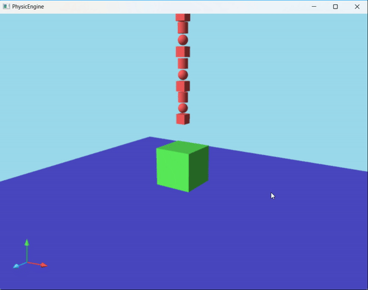

## 物理引擎

爸爸：KD-Engine 爷爷：Bullet Physics

- 碰撞检测：SAT

- 约束求解：Sequential Impulse

- 毁伤算法：Voronoi剖分

- 坦克：待移植

### 效果

- gif帧率20帧，实际运行帧率为60帧
- 破碎效果：根据事先设定好的毁伤源位置预计算（最终目标是根据坦克炮弹的击中位置实时计算）

- 履带坦克
    - Raycast：根据射线检测的深度设置impulse和suspension，表现为直接贴地
    - Contact：根据车轮与地面的碰撞结果设置impulse和suspension，力的反馈更真实
    - 目前履带没有碰撞效果，会有穿模发生，正在寻找方案解决(3.25)

| Raycast                               | Contact                                   |
|---------------------------------------|-------------------------------------------|
|  |  |

### 开发日志

- 2.26-3.3

    - box box碰撞跑通，引擎框架搭建完成

    - 破碎算法移植完成

    - 单线程，可以满足基本运行帧率

- 3.4-3.10

    - mesh mesh碰撞完成，待解决问题：

        - 穿模：一定程度上解决
        - penetration约束求解是否必要：应该是KD引擎里用了两份不同版本的算法，penetration部分在现有算法里没有影响，不必纠结

    - 多线程加速，待解决内容：

        - 时序一致性：已解决
        - 加锁问题：已解决

- 3.11-3.17

    - sequential impulse稳定性

        - 抖动、小程度穿模（一定程度上解决）cid：79a2a09a

    - 其他碰撞对：

        - box mesh = mesh mesh √
        - sphere shpere √
        - box shpere √
        - mesh shpere = sphere triangles √
        - cylinder cylinder = mesh mesh √
        - box cylinder = mesh mesh √
        - shpere cylinder √
        - mesh cylinder = mesh mesh √

- 3.18-3.24

    - 内存优化

        - FrictionContactConstraint对象占用空间较多，每一帧反复创建销毁，适合使用内存池，其他部分待定

    - Clion使用vs编译

        - 语法检查更严格

    - 检查碰撞检测
        - 1、margin
            - box-sphere取消getSphereDistance的margin
            - sphere-convex取消radiusWithThreshold的margin
        - 2、碰撞对顺序
            - 涉及cylinder的全部将cylinder放在前面
            - 最近点需要统一为物体B上的点

    - 履带坦克

        - 射线检测异常：
            - 地面fixedBody须设置质量和惯性矩阵均为0
            - 轮子添加实体之后，须设置raycastExcludeIds列表
            - 履带片不宜添加实体，否则会对非kinematic地面产生错误impulse
        - 优化点：
            - 1、使用多个射线检测（目前aabb检测不支持这种方式）
            - 2、使用碰撞检测代替射线检测（已选）
                - v0.1(10012d6): 车轮会抖动(1)，行进时suspension会异常变短(2)，过坎时计算出错(3)
                - v0.2(e25dbca): (3)已解决，(2)进一步发现有两种情况，一是以地面法矢量为接触法线，二是以车轮法矢量为接触法线，前者车轮下陷，后者suspension缩短
                - v0.3(ebceaaa): (1)部分解决，仍有轻微抖动，解决方式为当没有接触发生时，按递增方式还原suspension；(2)待解决
                - v1.0(f1e366e): 问题都已初步解决，待优化的点：轮子与可活动物体的碰撞
                - v1.1(de8fb1b): 解决了溜坡的问题
                - v2.0(b399d0b): 一些细节问题

### 问题日志

- 窄域碰撞优化：contact point cache size需要设置较大一点，实际计算时取depth最大的若干个即可，由于contact points已排过序，此时这些contact point即为最深的点

- 复杂几何体碰撞：偶尔穿模，示例为blob/0311/test4.obj

    - 棱碰撞问题：较薄的刚体在尖棱与其他模型发生碰撞时容易穿模，
        - 原因：clipFaceAgainstFace计算时所选取的witnessFace未能包含实际侵入点
        - 解决：findSeparateAxis找到最深点时检查是否在对面刚体内，若在则直接加入contact points
    - 严重问题：find separate axis的contact point计算错误
        - 原因：分离轴支撑点计算错误（应为物体上的点，不是在轴上的投影点）

- 多线程Release版崩溃：lambda参数捕获机制

    - 多线程lambda this = &捕获成员变量出现错误，只能函数内拷贝成局部变量，然后用&传递，=和名称传递都不行，可能是因为多线程重复访问同一个地址，编译器的优化保护机制有影响
    - 3.18发现：this捕获改成auto c = this, &c则可以正常运行，原因暂不清楚

- sequential impulse稳定性

    - 尝试使用各向异性的margin，没有明显改善，改回固定margin（0.005）
    - 部分解决：
        - 顾名思义，sequential impulse的迭代部分不能用多线程（一部分解决，小碎块仍然不稳定），同时解决了时序一致性的问题
        - 设置刚体的sleep threshold（速度小于阈值超过一定时间）
        - 还是会有穿模，示例为blob/0312/world

- cylinder碰撞不稳定

    - 原因：default mesh错误，已修改

- toolset更改为vs之后编译问题：无法写入清单文件

    - 解决：修改cmake generator为let cmake decide

- 内存池启动崩溃

    - 原因：设置的块大小过小，应至少大于一个对象的大小
    - 解决：加大小判断

- contact vehicle

    - 问题1：车轮抖动
        - 原因：车轮与地面的接触点不稳定，没有接触点时suspension直接还原
        - 解决：改为递增还原
    - 问题2：suspension速度快时会变短
        - 原因：速度增加导致contact depth变大，contact vehicle的特殊计算方式允许较短的suspension连续存在
        - 解决：设置suspension时不考虑contact depth，但计算形变量时加入contact depth
    - 问题3：过坎时出现计算异常
        - 原因：sqrt(<0)导致NaN (contact_vehicle.cpp: 182)
    - 问题4（新问题）：刹车异常，即使坡度很小也会溜
        - 已修改车轮刹车摩擦的计算方式 (contact_vehicle.cpp: 563)

- 引擎问题：工作中出现nan

    - 原因：normalize(0 0 0)导致NaN (sphere_cylinder_collision_algorithm.cpp: 39)
    - 解决：37行加r>0的判断

- todo list (not including world.h)
  - friction_contact_constraint.cpp: 108
  - contact_vehicle.cpp: 177
  - pool.cpp: 78